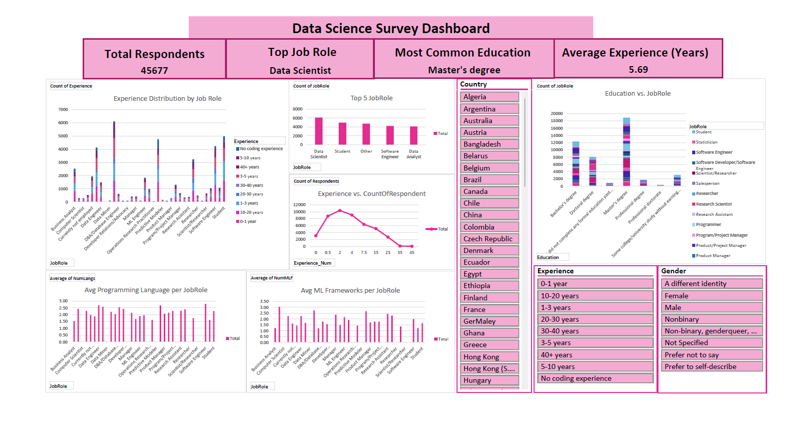

# Data Science Survey Dashboard  

A Data Cleaning and Insight Generation Project.

This project was an interactive data analytics project built with **Python** (for cleaning and preprocessing) and **Excel** (for dashboard visualization). The dataset is based on a Data Science survey (2017–2021) and showcases insights into demographics, education, job roles, experience, and tool usage among professionals.  

---

## 📊 Features  
- Data cleaning and preprocessing with Python (pandas, numpy).  
- Encoded categorical variables for dashboard readiness.  
- Excel dashboard with:  
  - KPIs (Total Respondents, Avg. Experience, Top Job Role, Top Programming Language).  
  - Pivot table insights.  
  - Interactive slicers (Age, Gender, Country, Education).  
  - Visualizations (bar chart, line chart, pie chart).  

---


## 📂 Project Structure

DS_Survey
├── DS_survey.xlsx
├── DS_Survey.py
├── requirements.txt
└── README.md


---

## ⚙️ Installation  

### 1️⃣ Clone the repository
```bash
git clone https://github.com/itsemhee/DS-Survey.git
cd tech-survey-dashboard
```

###2️⃣ Install dependencies
```bash
pip install -r requirements.txt
```


🚀 Usage
🔹 Run the data cleaning script
```bash
python scripts/DS_Survey.py
```


This will generate a cleaned CSV inside the DS_Survey/ folder.

🔹 Open the Excel Dashboard

Go to dashboard/DS_Survey.xlsx

Refresh pivot tables to load new data

Interact with slicers (Gender, Country, Experience)


🔍 Insights (from the Dashboard)

Here are some example insights discovered from the dataset:

Total Respondents: ~45,000+ survey participants

Top Job Role: Data Scientist

Average Experience: 5.69 years

Most Popular Programming Language: Python

Most Used ML Framework: Scikit-learn

Gender Split: Majority male respondents 


🛠️ Requirements

Python 3.8+

Excel 2016 or later


##DataSet
You can download the dataset from: https://www.kaggle.com/datasets/andradaolteanu/kaggle-data-science-survey-20172021

📸 Sample Dashboard Preview



